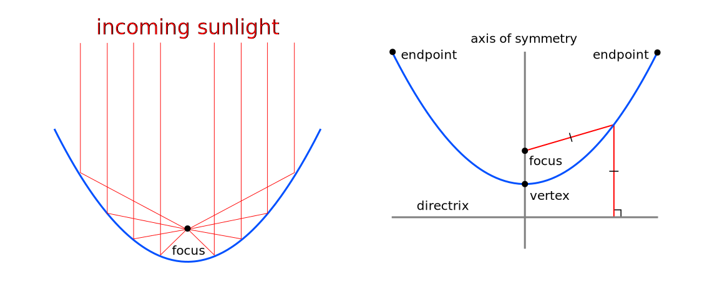
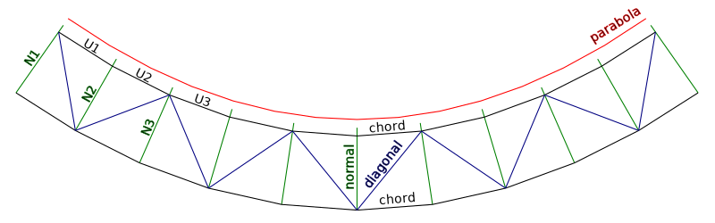
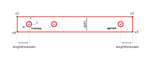

A mirror shaped like a parabola can be used to concentrate energy from the sun on a small area, from which the resulting heat might be carried off by water or some other medium. The following describes a script that creates a custom support structure for such a parabolic mirror. It is referred to as a *rib* and on one side follows the curve of a parabola, while on the other it is supported by a truss that keeps the parabola in the correct shape. The script is written in Python and runs in [FreeCAD][freecad], which is an open-source CAD/CAM package. It can be cloned from [Github][github] and needs to be placed in the `Macro` directory of your FreeCAD installation. To find where that is, start FreeCAD and click *Edit | Preferences | General | Macro* to have a look at the `Macro path` setting. The following uses the default location when FreeCAD was installed under [Ubuntu][ubuntu].

```
cd ~/.FreeCAD/Macro
git clone https://github.com/inatic/solar-concentrator solar
```

The script is executed in FreeCAD by simple importing it from the Python Console, activating the latter can be done under *View | Panels | Python Console*. When all goes well this creates a document with a parabola shaped rib as well as a cutlist for the bars that are used to build it. Parameters in the script allow changing the shape and size of the parabola as well as the design of the truss. Once imported and after making modifications to the script, it can be reloaded using the `importlib.reload` method.

```
from solar import concentrator
import importlib
importlib.reload(concentrator) 
```

# SCRIPT

The following explains how the script works and should allow for easier customization. It also includes some general information on scripting in FreeCAD. As any typical script it starts by importing necessary modules, after which it checks for a document that is open in the graphical user interface of your FreeCAD application and if necessary creates one. 

```python
import Part, Draft, math, copy
import FreeCAD
from FreeCAD import Base

doc = FreeCAD.ActiveDocument
if not doc:
    doc = FreeCAD.newDocument()
```

## PARABOLA

A reflective surface that follows the curve of a parabola can be used to concentrator solar energy. A parabola is defined by a point named the `focus`, which is where the light is concentrated, and an axis named the `directrix` which in our case comes under and along the length of the parabola. For each point on the parabola, the perpendicular distance to the directrix should be the same as the distance to the focus. Instead of a directrix our script uses a `Center` (also known as `vertex`), which is the point on the parabola's axis of symmetry that is midway between `focus` and `directrix`. A parabola is a mathematical construct that is not limited in size, any point that has equal distances to focus and directrix is part of the parabola. The reflective surface of a concentrator however has endpoints and these are specified as its `parameters`. 



The following uses the `Part` module to create a parabola with its `Center` at the origin. The plane of the parabola is perpendicular to the y-axis (`Axis`) and it is oriented along the positive Z-Axis (`XAxis`). The distance between the `Center` of the parabola and its focus is referred to as its `Focal` distance. Endpoints to both sides of the parabola are specified as distances along its `directrix`, starting from the origin and going in both directions (`parameter1` and `parameter2`). Turning the mathematical curve into an `edge` shape that can be added to a document is done using the `toShape` method, taking previous parameters as arguments.

```python
focalDistance = 1000
parameter1 = -1500
parameter2 = 1500

parabola = Part.Parabola()
parabola.Center = FreeCAD.Vector(0,0,0)
parabola.Axis = FreeCAD.Vector(0,1,0)
parabola.XAxis = FreeCAD.Vector(0,0,1)
parabola.Focal = focalDistance
edge = parabola.toShape(parameter1, parameter2)
objectParabola = doc.addObject('Part::Feature', 'Parabola')
objectParabola.Shape = edge
objectFocus = doc.addObject('Part::Feature', 'Focus')
pipe = Part.Face(Part.Wire(Part.makeCircle(50, parabola.Focus, parabola.Axis))).extrude(parabola.Axis*20)
objectFocus.Shape = pipe
```

## TRUSS

For the mirror to follow the curve of a parabola, it needs to be supported by a rigid and sufficiently accurate structure. The idea is to create a number of parabola-shaped ribs on which mirrors are mounted. Each rib is constructed as a truss which makes it relatively strong and easy to fabricate. The mirror mounts to a piece of bar stock (e.g. 20x5mm hot rolled steel), and the bar stock mounts to angle brackets that are spaced along the length of the parabola (`bracketSpacing`). Spacing is calcuated by dividing the parabola in a number of equal length `subdivisions`. For each bracket the parameter on the parabola (coordinate on the directrix) is calculated, followed by the vector of its location, and the vector normal to the parabola at that location (see illustration). The normal vector determines the direction of truss members that point down from the back of the parabola. As these truss members are oriented normal (perpendicular) to the parabola I'm going to refer to them as *normal* members. Each `normal` member has 5 holes: holes at top and bottom to mount other components, a hole for mounting the bracket, one for mounting upper chords, and one for mounting lower chords. At the top mounting holes a structure will be attached to hold something like a tube carrying water at the focus, and the bottom mounting holes attach to a beam that holds all the ribs and turns with the sun. The location of these holes is measured as an offset from the reflective surface of the parabola and respectively named `topMountOffset`, `bracketOffset`, `upperChordOffset`, `lowerChordOffset` and `bottomMountOffset`. Each *normal* member in the `normalMembers` list stores hole location vectors. As these are hole locations, bars themselves need to be longer and each truss member is extended by a distance referred to as `lengthExtension`.



```python
subdivisions = 9
topMountOffset = 25
bracketOffset = 25
upperChordOffset = bracketOffset + 50
lowerChordOffset = bracketOffset + 250
bottomMountOffset = 50

bracketSpacing = edge.Length/subdivisions

normalMembers = []
for i in range(0, subdivisions + 1):
    bracketPosition = i*bracketSpacing
    parameter = edge.getParameterByLength(bracketPosition)
    normal = edge.normalAt(parameter).normalize()
    pointOnParabola = edge.valueAt(parameter)
    topMountPoint = pointOnParabola + topMountOffset*normal
    bracketMountPoint = pointOnParabola - bracketOffset*normal
    upperChordMountPoint = pointOnParabola - upperChordOffset*normal
    lowerChordMountPoint = pointOnParabola - lowerChordOffset*normal
    bottomMountPoint = lowerChordMountPoint - bottomMountOffset*normal
    normalMembers.append( (topMountPoint, bracketMountPoint, upperChordMountPoint, lowerChordMountPoint, bottomMountPoint) )
```

Other members of the truss are quite easy to create - they just connect the holes of adjoining normal truss members. Upper and lower chord members of the truss are created in this way, as are the diagonal members that form triangles and are drawn in a zig-zag pattern.

```python
upperChords = []
for i in range(0,len(normalMembers)-1):
    upperChordPoint0 = normalMembers[i][2]
    upperChordPoint1 = normalMembers[i+1][2]
    upperChords.append((upperChordPoint0, upperChordPoint1))

lowerChords = []
for i in range(0,len(normalMembers)-1):
    lowerChordPoint0 = normalMembers[i][3]
    lowerChordPoint1 = normalMembers[i+1][3]
    lowerChords.append((lowerChordPoint0, lowerChordPoint1))

diagonals = []
for i in range(0,len(normalMembers)-1):
  if (i % 2) == 0:
    diagonalPoint0 = normalMembers[i][2]
    diagonalPoint1 = normalMembers[i+1][3]
  else:
    diagonalPoint0 = normalMembers[i][3]
    diagonalPoint1 = normalMembers[i+1][2]
  diagonals.append((diagonalPoint0,diagonalPoint1))
```

## COLLECTOR

Solar energy is concentrated and the resulting heat collected at the focal point of the parabola, where a collector is held in place by a supporting truss structure. As the collector builds on this structure, some distance (`supportOffset`) is left between the end of the support structure and the focal point of the parabola. The top of the support structure (`supportTopWidth`) is narrower than its bottom, and a number of web members (`webMembers`) give the structure additional strength. At the bottom the support structure attached to the normal members of the parabola's truss. If there is an even number of normal members, the structure attaches to the pair in the middle. If there is an odd number of normal members, the pair adjacent to the middle normal member is used to connect the collector structure. Attachment points are named `supportBase1` and `supportBase2`.

```python
collectorOffset = 150
supportTopWidth = 30
webMembers = 5

collectorSupportMembers = []

num = len(normalMembers)
if num % 2 == 0:
  # even number of members
  indexMember1 = int(num/2 - 1)
  indexMember2 = int(num/2)
else:
  # odd number of members
  indexMember1 = int((num+1)/2 - 2)
  indexMember2 = int((num+1)/2)

supportBase1 = normalMembers[indexMember1][0]
supportBase2 = normalMembers[indexMember2][0]
```

Endpoints for side members are determined by starting at the focus of the parabola, subtracting `collectorOffset`, and moving half of `supportTopWidth` to each side. Members are then added to the `collectorSupportMembers` list.

```python
uDirection = (parabola.Focus - parabola.Center).normalize()
vDirection = (supportBase1 - supportBase2).normalize()
supportTop1 = parabola.Focus - collectorOffset*uDirection + (supportTopWidth/2)*vDirection
supportTop2 = parabola.Focus - collectorOffset*uDirection - (supportTopWidth/2)*vDirection

collectorSupportMembers.append([supportBase1, supportTop1])
collectorSupportMembers.append([supportBase2, supportTop2])
collectorSupportMembers.append([supportTop1, supportTop2])
```

A number of web members (`webMembers`) connect at regular intervals along the length of the side members in a zigzag pattern. Points on side members are specified in terms of their respective direction vectors `dir1` and `dir2`. 

```python
dir1 = (supportTop1 - supportBase1).normalize()
dir2 = (supportTop2 - supportBase2).normalize()
sideMemberLength = (supportTop1 - supportBase1).Length
webMemberStep = sideMemberLength / webMembers

for i in range(1, webMembers):
  if i % 2 == 0:
    height1 = (i-1) * webMemberStep
    height2 = i * webMemberStep
  else:
    height2 = (i-1) * webMemberStep
    height1 = i * webMemberStep
  point1 = supportBase1 + height1*dir1
  point2 = supportBase2 + height2*dir2
  collectorSupportMembers.append([point1, point2])
```


## BARS

Each bar is represented by a `Bar` object, which is drawn over the lines of the truss and attaches to other bars at the intersection points of the truss (`holes`). The hole coordinates for different types of bars are stored in lists `normalMembers`, `upperChords`, `lowerChords` and `diagonals`. Each `Bar` object has its own coordinate system (u,v,w) that helps creating the necessary geometry. The axis perpendicular to the parabola corresponds to the `w` axis of the bar, while the `u` axis points along the length of the bar. Bars are offset along the wAxis (`wAxisOffset`) so they don't overlap. A `lengthExtension` parameter extends the bar to both sides, starting at the outer holes. A `Bar` object furthermore has a `width`, `thinkness` and a diameter for its holes (`holeDiameter`). It also has a `name` that identifies the bar in the FreeCAD document and should probably be written on the physical bar to keep track of its location in the truss. 



```python
class Bar:
    def __init__(self, holes, wAxis, wAxisOffset, lengthExtension, width, thickness, holeDiameter, name):
        self.holes = holes
        self.wAxis = wAxis
        self.wAxisOffset = wAxisOffset
        self.lengthExtension = lengthExtension
        self.width = width
        self.thickness = thickness
        self.holeDiameter = holeDiameter
        self.name = name
        self.offsetHoles = [hole + self.wAxisOffset*self.wAxis for hole in self.holes]
        # Local coordinate system
        firstHole = self.offsetHoles[0]
        lastHole = self.offsetHoles[-1]
        self.u = (lastHole - firstHole).normalize()
        self.w = self.wAxis
        self.v = self.w.cross(self.u)
```

The `getShape` method of a `Bar` object creates a `Part` shape that can be added to the FreeCAD document. It starts with the offset hole positions and uses the `Bar` object's coordinate system (`uvw`) to create corner points and connects them to create a face. Holes are cut out of this face and the result is extruded to create a solid bar.

```python
def getShape(self):
    firstHole = self.offsetHoles[0]
    lastHole = self.offsetHoles[-1]
    # Points
    holeDistance = (lastHole - firstHole).Length
    v1 = firstHole + (self.width/2)*self.v - (self.lengthExtension)*self.u
    v2 = v1 + holeDistance*self.u + 2*(self.lengthExtension)*self.u
    v3 = v2 - self.width*self.v
    v4 = firstHole - (self.width/2)*self.v - (self.lengthExtension)*self.u
    # Face
    line1 = Part.Edge(Part.LineSegment(v1, v2))
    line2 = Part.Edge(Part.LineSegment(v2, v3))
    line3 = Part.Edge(Part.LineSegment(v3, v4))
    line4 = Part.Edge(Part.LineSegment(v4, v1))
    wire = Part.Wire([line1, line2, line3, line4])
    face = Part.Face(wire)
    # Cut holes
    for hole in self.offsetHoles:
        circle = Part.Face(Part.Wire(Part.makeCircle(self.holeDiameter/2, hole, self.w)))
        face = face.cut(circle)
    solid = face.extrude(self.thickness*self.w)
    return solid
```

The `getHolePositions` method in turn provides the locations of holes in the bar, measured from the beginning of the bar. 

```python
def getHolePositions(self):
    positions = []
    firstHole = self.offsetHoles[0]
    lastHole = self.offsetHoles[-1]
    barStart = firstHole - (self.lengthExtension)*self.u
    for hole in self.offsetHoles:
        distanceFromStart = (hole - barStart).Length
        positions.append(distanceFromStart)
    return positions
```

## CUTLIST

Lengths of bars and the locations for holes to be drilled are added to a `SpreadSheet` object named `Cutlist`. This is done by iterating over `Bar` objects and fetching the positions of holes using the `getHolePositions` method. We're also keeping track of the total length of bar stock (`totalBarLength`) that is used to build the truss in order to have an estimate of material requirements. 

```python
totalBarLength = 0
for bar in bars:
    sheet.set('A'+str(row), bar.name)
    length = bar.getLength()
    totalBarLength += length
    sheet.set('B'+str(row), str(round(length,2)))
    holePositions = bar.getHolePositions()
    for j in range(0, len(holePositions)):
        column = chr(67+j)
        sheet.set(str(column)+str(row), str(round(holePositions[j],2)))
    row+=1
``` 

[freecad]: (https://www.freecadweb.org/)
[github]: (https://github.com/inatic/solar-concentrator)
[ubuntu]: (https://ubuntu.com/)
